# Titan Scanner — System Architecture Diagram

## How to read this document

There are two diagrams in this file, and the distance between them is the point.

1. **Current architecture** (first diagram) — a monolithic, bounded-concurrency asyncio
   application. This is deliberate, not an accident of growth: Titan's v1 operating point
   is a single operator running consent-gated scans against one target estate from one
   machine. The monolith is internally modular — per-area detectors under `titan/modules/`,
   a lazy dispatch table (`titan/core/module_bindings.py`), a mixin-decomposed engine —
   which is exactly what makes the v2 extraction below a mechanical migration rather than
   a rewrite.
2. **Target distributed architecture** (second diagram) — the enterprise-scale v2:
   queue-based services, fleet agents as the primary scan runtime, split persistence, and
   a 9-phase strangler-fig migration path.

Known limitations of the current monolith, stated up front rather than left for a
reviewer to discover:

| Limitation | Status |
|---|---|
| Single-process throughput ceiling | By design for v1 (single operator, single box). Concurrency is bounded (`asyncio.Semaphore`, `crawl.module_concurrency`), not unbounded; v2 removes the ceiling via fleet agents and queue workers |
| Fleet runs "beside" the engine in diagram one | That is the code as it exists today — `titan/fleet/{coordinator,agents}.py` are implemented, but the agent is not yet the primary runtime. v2 makes agents the runtime |
| Central verification kernel | Intentional, and **active**: verification re-probes the target with benign negative controls *through the transport layer* — the `kernel → transport` edge is load-bearing, not a drawing error. v2 distributes verification workers while keeping the same active-verification contract |
| Single-node state | Right-sized for v1 (scan state is per-campaign, local, and disposable); v2 splits into Redis/PostgreSQL/object storage |
| Evolution / REPL / webshell complexity | Research-grade features are consent-gated and sequenced behind the core scan pipeline; see the migration phases |

```mermaid
graph TB
    subgraph "CLI LAYER"
        tscan_main["titan/tscan_main.py<br/>Console entry point"]
        cli["titan/cli.py<br/>Full CLI (scan, report, list, status)"]
        run_py["run.py<br/>Quick launcher (--exploit, --doctor, dashboard)"]
    end

    subgraph "CORE ENGINE"
        engine["TitanEngine<br/>titan/core/engine.py"]
        crawl["BFS Crawl Loop<br/>titan/core/crawl.py"]
        discovery["Page/Probe Discovery<br/>titan/core/discovery.py"]
        modules_runner["ModuleRunner<br/>titan/core/modules_runner.py"]
        fingerprint["TechFingerprinter<br/>titan/core/fingerprint.py"]
        auth["AuthEngine<br/>titan/core/auth.py"]
        stealth["StealthEngine<br/>titan/core/stealth.py"]
        state["Scan State Persistence<br/>titan/core/state.py"]
    end

    subgraph "MODULE MATRIX"
        modules_runner --> sqli["sqli/ (UNION, boolean, error, OOB)"]
        modules_runner --> xss["xss/ (reflected, stored, DOM)"]
        modules_runner --> ssrf["ssrf/"]
        modules_runner --> idor["idor/"]
        modules_runner --> lfi["lfi/"]
        modules_runner --> rce["rce/"]
        modules_runner --> ssti["ssti/"]
        modules_runner --> xxe["xxe/"]
        modules_runner --> jwt["jwt/"]
        modules_runner --> baas["baas/ (Supabase, Firebase, AppWrite)"]
        modules_runner --> api["api/ (REST/GraphQL)"]
        modules_runner --> graphql["graphql/ (depth, batching, mutations)"]
        modules_runner --> logic["logic/ (business logic, price tampering)"]
        modules_runner --> cors["cors/"]
        modules_runner --> headers["headers/"]
        modules_runner --> tls["tls/"]
        modules_runner --> dns["dns/"]
        modules_runner --> supply["supplychain/"]
        modules_runner --> nosqli["nosqli/"]
        modules_runner --> deser["deser/"]
        modules_runner --> race["race/"]
        modules_runner --> cache["cache/"]
        modules_runner --> smb["smuggling/"]
        modules_runner --> ss["sourcesecret/"]
        modules_runner --> rl["ratelimit/"]
        modules_runner --> cloud["cloud/"]
        modules_runner --> ws["websocket/"]
        modules_runner --> fuzzer["fuzzer/"]
        modules_runner --> clientside["clientside/"]
        modules_runner --> crypto["crypto/"]
        modules_runner --> llm["llm/ (LLM-specific)"]
        modules_runner --> upload["upload/"]
        modules_runner --> redirect["redirect/"]
        modules_runner --> ssrf_pivot["ssrf_pivot/"]
        modules_runner --> bola["bola/"]
        modules_runner --> mass["massassignment/"]
    end

    subgraph "AI LAYER"
        payloadsmith["PayloadSmith<br/>titan/ai/payloadsmith.py"]
        waf_fingerprint["WAF Fingerprint<br/>titan/ai/waf_fingerprint.py"]
        waf_profiles["WAF Bypass Profiles<br/>titan/ai/waf_profiles.py"]
        platform_payloads["Platform Payloads<br/>titan/ai/platform_payloads.py"]
    end

    subgraph "VERIFICATION LAYER"
        kernel["Kernel<br/>titan/verify/kernel.py"]
        auto_verify["Auto Verify<br/>titan/verify/auto_verify.py"]
        oracles["Oracles<br/>titan/verify/oracles.py"]
        llm_oracles["LLM Oracles<br/>titan/verify/llm_oracles.py"]
        identity_oracles["Identity Oracles<br/>titan/verify/identity_oracles.py"]
        chain_analyzer["Chain Analyzer<br/>titan/verify/chain_analyzer.py"]
        verdicts["Verdict Classification<br/>titan/verify/verdicts.py"]
        coverage["Coverage Verification<br/>titan/verify/coverage.py"]
        repro["Repro Script Generation<br/>titan/verify/repro.py"]
    end

    subgraph "TRANSPORT LAYER"
        base["Transport Base<br/>titan/transport/base.py"]
        http["HTTP/HTTPS<br/>titan/transport/http_transport.py"]
        tor["Tor-routed<br/>titan/transport/tor.py"]
        grpc["gRPC<br/>titan/transport/grpc.py"]
        ws_trans["WebSocket<br/>titan/transport/websocket.py"]
        ssh["SSH<br/>titan/transport/ssh.py"]
        mqtt["MQTT<br/>titan/transport/mqtt.py"]
    end

    subgraph "EXPLOIT LAYER"
        consent["Consent Parser<br/>titan/exploit/consent.py"]
        planner["Exploit Planner<br/>titan/exploit/planner.py"]
        listener["C2 Listener<br/>titan/exploit/listener.py"]
        webshell["Webshell<br/>titan/exploit/webshell.py"]
        ssrf_pivot_exploit["SSRF Pivot<br/>titan/exploit/ssrfpivot.py"]
        sqlidump["SQLi Dump<br/>titan/exploit/sapidump.py"]
        repl["Live REPL<br/>titan/exploit/repl.py"]
    end

    subgraph "REPORTING LAYER"
        dashboard["Interactive HTML Dashboard<br/>titan/reporting/dashboard.py"]
        estate["Estate-wide Rollup<br/>titan/reporting/estate.py"]
        md_report["Markdown Report<br/>titan/reporting/markdown_report.py"]
        remed["Remediation Report<br/>titan/reporting/remediation.py"]
    end

    subgraph "FLEET"
        fleet_coord["FleetCoordinator<br/>titan/fleet/coordinator.py"]
        fleet_agents["Agent Pool<br/>titan/fleet/agents.py"]
    end

    subgraph "BRAIN"
        strategy["Strategy Engine<br/>titan/brain/strategy.py"]
        evolution["Evolution<br/>titan/brain/evolution.py"]
    end

    cli --> engine
    run_py --> engine
    tscan_main --> cli

    engine --> crawl
    engine --> discovery
    engine --> modules_runner
    engine --> fingerprint
    engine --> auth
    engine --> stealth
    engine --> state

    crawl --> modules_runner
    discovery --> modules_runner

    modules_runner --> sqli
    modules_runner --> xss
    modules_runner --> ssrf
    modules_runner --> idor
    modules_runner --> lfi
    modules_runner --> rce
    modules_runner --> ssti
    modules_runner --> xxe
    modules_runner --> jwt
    modules_runner --> baas
    modules_runner --> api
    modules_runner --> graphql
    modules_runner --> logic
    modules_runner --> cors
    modules_runner --> headers
    modules_runner --> tls
    modules_runner --> dns
    modules_runner --> supply
    modules_runner --> nosqli
    modules_runner --> deser
    modules_runner --> race
    modules_runner --> cache
    modules_runner --> smb
    modules_runner --> ss
    modules_runner --> rl
    modules_runner --> cloud
    modules_runner --> ws
    modules_runner --> fuzzer
    modules_runner --> clientside
    modules_runner --> crypto
    modules_runner --> llm
    modules_runner --> upload
    modules_runner --> redirect
    modules_runner --> ssrf_pivot
    modules_runner --> bola
    modules_runner --> mass

    engine --> payloadsmith
    engine --> waf_fingerprint

    modules_runner --> kernel
    kernel --> auto_verify
    kernel --> oracles
    kernel --> llm_oracles
    kernel --> identity_oracles
    kernel --> chain_analyzer
    kernel --> verdicts
    kernel --> coverage
    kernel --> repro

    modules_runner --> base
    base --> http
    base --> tor
    base --> grpc
    base --> ws_trans
    base --> ssh
    base --> mqtt

    engine --> fleet_coord
    fleet_coord --> fleet_agents

    engine --> strategy
    strategy --> evolution

    kernel --> dashboard
    kernel --> estate
    kernel --> md_report
    kernel --> remed

    auto_verify --> engine

    engine --> consent
    consent --> planner
    consent --> listener
    consent --> webshell
    consent --> ssrf_pivot_exploit
    consent --> sqlidump
    consent --> repl
```



## Layer Descriptions

### CLI LAYER
The user-facing interface. `tscan_main.py` is the console entry point that fixes CWD shadow issues then delegates to `cli.py`. `cli.py` provides subcommands (`scan`, `report`, `list`, `status`, `delete`) and flags (`--exploit`, `--doctor`). `run.py` is the quick launcher for ad-hoc scans.

### CORE ENGINE
The orchestration heart. `TitanEngine` mixes in transport, browser, dispatch, helpers, and post-scan phases. It manages crawl profiles (fast/deep/hostile), session pools, fingerprinting, and coverage. `crawl.py` is a breadth-first crawl loop. `discovery.py` finds pages and probes. `modules_runner.py` dispatches attack modules. `fingerprint.py` identifies technologies and BaaS backends. `auth.py` handles login and session management.

### MODULE MATRIX
The detector matrix. Each of the 49 subdirectories under `titan/modules/` contains one or more attack-area detectors. They are grouped by form, link, API, or GraphQL endpoint and run against discovered parameters and endpoints.

### AI LAYER
Payload mutation and WAF adaptation. `PayloadSmith` generates and mutates payloads using DeepSeek or Ollama. `WAFFingerprint` detects WAFs. `WAFProfiles` provide bypass strategies. `PlatformPayloads` serve platform-specific payloads.

### VERIFICATION LAYER
Evidence grading with negative controls. `auto_verify.py` sends benign control payloads alongside attack payloads; if both get the same response, the finding is demoted. `oracles.py` provides verification logic. `verdicts.py` classifies findings as `confirmed`/`suspicious`/`none`.

### TRANSPORT LAYER
Pluggable protocol abstraction. `base.py` defines the `AttackRequest` and `TransportProtocol` enum. Each transport (HTTP, Tor, gRPC, WebSocket, SSH, MQTT) sends requests through the scanner's proxy and rotation pool.

### EXPLOIT LAYER
Consent-gated exploitation (Track E). `consent.py` parses signed consent files. `planner.py` builds exploit plans. `listener.py` is the C2 listener. `webshell.py` deploys webshells. `ssrfpivot.py` handles SSRF pivoting. `sapidump.py` extracts data via SQLi.

### REPORTING LAYER
Output generation. `dashboard.py` builds the interactive HTML dashboard. `estate.py` creates estate-wide rollup reports. `markdown_report.py` generates markdown. `remediation.py` creates remediation-focused reports.

### FLEET
Multi-agent coordination. `FleetCoordinator` orchestrates multiple agents scanning multiple targets with Thompson Sampling and cross-agent dedup.

### BRAIN
Strategy engine. `strategy.py` decides what to scan next. `evolution.py` evolves scan strategies over the course of an engagement.

## Data Flow

```
Target URL
    ↓
[CLI] Config + Consent Validation
    ↓
[Crawl] BFS crawl, fingerprint, discover endpoints
    ↓
[Module Matrix] 49-area detector dispatch
    ↓
[AI Layer] Optional payload mutation
    ↓
[Verification] Negative controls, evidence grading
    ↓
[Reporting] HTML dashboard, markdown, JSON, repro scripts
```

## Target Distributed Architecture (v2)

This diagram represents the **proposed** distributed architecture that addresses the bottlenecks identified in the current monolithic design. This is the target state, not the current implementation.

```mermaid
graph TB
    subgraph "CLI LAYER"
        cli["titan/cli.py<br/>Full CLI (scan, report, list, status)"]
        run_py["run.py<br/>Quick launcher"]
        tscan_main["titan/tscan_main.py<br/>Console entry point"]
    end

    subgraph "API GATEWAY"
        api_gw["API Gateway<br/>REST/GraphQL/gRPC endpoints"]
    end

    subgraph "JOB QUEUE"
        queue["Message Broker<br/>RabbitMQ / Kafka / SQS"]
        crawl_queue["crawl-jobs"]
        module_queue["module-jobs"]
        verify_queue["verification-jobs"]
        report_queue["report-jobs"]
    end

    subgraph "CONTROLLER NODE"
        controller["ScanController<br/>Orchestrates scan lifecycle"]
        config_val["ConfigValidator<br/>Pydantic schema validation"]
        consent_val["ConsentValidator<br/>Signed consent enforcement"]
        auth_val["AuthValidator<br/>Authentication policy check"]
    end

    subgraph "CRAWL SERVICE"
        crawl_svc["CrawlService<br/>Stateless BFS crawler"]
        fingerprint_svc["FingerprintService<br/>Technology detection"]
        discovery_svc["DiscoveryService<br/>Endpoint/probe discovery"]
    end

    subgraph "MODULE WORKERS ( horizontally scalable )"
        worker_pool["Worker Pool<br/>Auto-scaling"]
        sqli_w["sqli-worker"]
        xss_w["xss-worker"]
        ssrf_w["ssrf-worker"]
        idor_w["idor-worker"]
        lfi_w["lfi-worker"]
        rce_w["rce-worker"]
        graphql_w["graphql-worker"]
        baas_w["baas-worker"]
        logic_w["logic-worker"]
        api_w["api-worker"]
        generic_w["generic-worker<br/>(catch-all for other modules)"]
    end

    subgraph "AI SERVICE"
        ai_svc["AIService<br/>Payload mutation & WAF bypass"]
        payloadsmith["PayloadSmith<br/>titan/ai/payloadsmith.py"]
        waf_fp["WAF Fingerprint<br/>titan/ai/waf_fingerprint.py"]
        waf_prof["WAF Bypass Profiles<br/>titan/ai/waf_profiles.py"]
    end

    subgraph "VERIFICATION SERVICE"
        verify_svc["VerificationService<br/>Evidence grading workers"]
        auto_verify["AutoVerify<br/>Negative controls"]
        oracles["Oracles<br/>Verification logic"]
        verdicts["VerdictClassifier<br/>confirmed/suspicious/none"]
        chain_analyzer["ChainAnalyzer<br/>Attack chain analysis"]
    end

    subgraph "TRANSPORT SERVICE"
        transport_svc["TransportService<br/>Shared HTTP/gRPC/WebSocket/Tor/SSH/MQTT"]
        transport_base["Transport Base<br/>titan/transport/base.py"]
        transport_http["HTTP/HTTPS"]
        transport_tor["Tor-routed"]
        transport_grpc["gRPC"]
        transport_ws["WebSocket"]
        transport_ssh["SSH"]
        transport_mqtt["MQTT"]
    end

    subgraph "PERSISTENCE LAYER"
        redis["Redis Cluster<br/>Scan state, findings cache, job state"]
        postgres["PostgreSQL<br/>Findings store, audit log, CVSS scores"]
        object_store["S3/MinIO<br/>Reports, repro scripts, evidence artifacts"]
    end

    subgraph "FLEET COORDINATOR"
        fleet_ctrl["FleetCoordinator<br/>titan/fleet/coordinator.py"]
        agent_reg["Agent Registry<br/>Active workers, health, load"]
        job_scheduler["Job Scheduler<br/>Thompson Sampling target assignment"]
        merger["FindingMerger<br/>Cross-agent dedup + corroboration"]
    end

    subgraph "FLEET AGENTS"
        agent1["Agent: Crawl + Modules"]
        agent2["Agent: Crawl + Modules"]
        agent3["Agent: Crawl + Modules"]
        agentN["Agent: ..."]
    end

    subgraph "BRAIN SERVICE"
        brain["StrategyEngine<br/>titan/brain/strategy.py"]
        evolution["Evolution<br/>titan/brain/evolution.py"]
        metrics["MetricsCollector<br/>Engagement telemetry"]
    end

    subgraph "EXPLOIT SERVICE (consent-gated)"
        exploit_svc["ExploitService<br/>Track E: active exploitation"]
        consent_mgr["ConsentManager<br/>Signed consent verification"]
        exploit_planner["ExploitPlanner<br/>titan/exploit/planner.py"]
        c2_listener["C2Listener<br/>titan/exploit/listener.py"]
        sqlidump["SQLiDump<br/>titan/exploit/sapidump.py"]
        ssrf_pivot["SSRFPivot<br/>titan/exploit/ssrfpivot.py"]
    end

    subgraph "REPORTING SERVICE"
        report_svc["ReportService<br/>Async report generation"]
        dashboard["DashboardBuilder<br/>titan/reporting/dashboard.py"]
        markdown["MarkdownReport<br/>titan/reporting/markdown_report.py"]
        estate["EstateReport<br/>titan/reporting/estate.py"]
        remed["RemediationReport<br/>titan/reporting/remediation.py"]
    end

    subgraph "INGEST / INGEST API"
        ingest["Ingest API<br/>External tool integration"]
        webhooks["Webhooks<br/>titan/core/webhooks.py"]
        api_clients["API Clients<br/>REST/GraphQL/gRPC"]
    end

    cli --> api_gw
    run_py --> api_gw
    tscan_main --> api_gw

    api_gw --> controller
    controller --> config_val
    controller --> consent_val
    controller --> auth_val

    controller --> crawl_queue
    controller --> module_queue
    controller --> verify_queue
    controller --> report_queue

    crawl_queue --> crawl_svc
    crawl_svc --> fingerprint_svc
    crawl_svc --> discovery_svc
    crawl_svc --> module_queue
    discovery_svc --> module_queue

    module_queue --> worker_pool
    worker_pool --> sqli_w
    worker_pool --> xss_w
    worker_pool --> ssrf_w
    worker_pool --> idor_w
    worker_pool --> lfi_w
    worker_pool --> rce_w
    worker_pool --> graphql_w
    worker_pool --> baas_w
    worker_pool --> logic_w
    worker_pool --> api_w
    worker_pool --> generic_w

    sqli_w --> transport_svc
    xss_w --> transport_svc
    ssrf_w --> transport_svc
    idor_w --> transport_svc
    lfi_w --> transport_svc
    rce_w --> transport_svc
    graphql_w --> transport_svc
    baas_w --> transport_svc
    logic_w --> transport_svc
    api_w --> transport_svc
    generic_w --> transport_svc

    transport_svc --> transport_base
    transport_base --> transport_http
    transport_base --> transport_tor
    transport_base --> transport_grpc
    transport_base --> transport_ws
    transport_base --> transport_ssh
    transport_base --> transport_mqtt

    sqli_w --> ai_svc
    xss_w --> ai_svc
    ssrf_w --> ai_svc
    graphql_w --> ai_svc
    baas_w --> ai_svc

    ai_svc --> payloadsmith
    ai_svc --> waf_fp
    ai_svc --> waf_prof

    sqli_w --> verify_queue
    xss_w --> verify_queue
    ssrf_w --> verify_queue
    idor_w --> verify_queue
    lfi_w --> verify_queue
    rce_w --> verify_queue
    graphql_w --> verify_queue
    baas_w --> verify_queue
    logic_w --> verify_queue
    api_w --> verify_queue
    generic_w --> verify_queue

    verify_queue --> verify_svc
    verify_svc --> auto_verify
    verify_svc --> oracles
    verify_svc --> verdicts
    verify_svc --> chain_analyzer

    auto_verify --> transport_svc
    oracles --> redis

    verify_svc --> postgres
    verify_svc --> report_queue

    report_queue --> report_svc
    report_svc --> dashboard
    report_svc --> markdown
    report_svc --> estate
    report_svc --> remed

    report_svc --> object_store
    report_svc --> api_gw

    crawl_svc --> redis
    worker_pool --> redis
    verify_svc --> redis
    report_svc --> redis

    crawl_svc --> postgres
    worker_pool --> postgres
    verify_svc --> postgres

    controller --> fleet_ctrl
    fleet_ctrl --> agent_reg
    fleet_ctrl --> job_scheduler
    fleet_ctrl --> merger

    job_scheduler --> crawl_queue
    job_scheduler --> module_queue

    agent1 --> crawl_svc
    agent1 --> worker_pool
    agent2 --> crawl_svc
    agent2 --> worker_pool
    agent3 --> crawl_svc
    agent3 --> worker_pool
    agentN --> crawl_svc
    agentN --> worker_pool

    merger --> postgres

    fleet_ctrl --> brain
    brain --> evolution
    brain --> metrics
    metrics --> postgres

    brain --> job_scheduler

    controller --> exploit_svc
    exploit_svc --> consent_mgr
    exploit_svc --> exploit_planner
    exploit_svc --> c2_listener
    exploit_svc --> sqlidump
    exploit_svc --> ssrf_pivot

    consent_mgr --> postgres
    exploit_svc --> transport_svc
    exploit_svc --> report_queue

    ingest --> api_gw
    webhooks --> api_gw
    api_clients --> api_gw
```



## Key Architectural Changes

### 1. Event-Driven, Queued Architecture

```
Crawl → Enqueue URLs → Discovery Service → Enqueue probes
    → Module Runner dequeues probes → Assigns attack module
    → Module enqueues raw findings → Distributed Verification
    → Dequeues findings → Auto-verify/grade evidence
    → Enqueue confirmed findings → Report Service
```

**Components:**
- **Message Broker**: RabbitMQ, Kafka, or AWS SQS for durable job queues
- **Controller Node**: Lightweight job manager; validates config, consent, and auth; enqueues jobs
- **Crawl Service**: Stateless BFS crawler; discovers endpoints and enqueues probe jobs
- **Module Workers**: Horizontally scalable workers; each runs a subset of attack modules
- **Verification Service**: Distributed verification workers; apply oracles and grade evidence
- **Report Service**: Async report generation from confirmed findings

### 2. Fleet as Core Scanners

The **Fleet Agents** become the primary runtime. Each agent runs the full scan pipeline (crawl + modules + verification) for a subset of targets. The **FleetCoordinator** assigns targets/jobs via the message broker and merges findings.

```
FleetCoordinator
    ↓
[Job Queue] → Agent 1 (Target A)
            → Agent 2 (Target B)
            → Agent 3 (Target C)
    ↓
[Merger] → Dedup + corroboration → Unified findings
```

### 3. Distributed Persistence

- **Redis Cluster**: Scan state, findings cache, job state, distributed locks
- **PostgreSQL**: Persistent findings store, audit log, CVSS scores, engagement metadata
- **S3/MinIO**: Reports, repro scripts, evidence artifacts, scan logs

### 4. Transport as Shared Service

The **TransportService** is a shared HTTP/gRPC/WebSocket/Tor/SSH/MQTT service that all workers connect to. It manages proxy rotation, rate limiting, and egress policies centrally.

### 5. Brain as Strategy Service

The **Brain Service** collects metrics from all scans and evolves strategies. It feeds optimized scan parameters back to the FleetCoordinator via the job queue.

### 6. Exploit as Separate Service

Active exploitation (Track E) is a separate consent-gated service. It only activates after verification confirms a finding and a valid consent file is presented.

## Data Flow in Distributed Model

```
User Request (CLI / API)
    ↓
[API Gateway] → [Controller]
    ↓
[Config + Consent + Auth Validation]
    ↓
[Message Broker]
    ↓
[Crawl Service] → [Discovery] → [Module Queue]
    ↓
[Module Workers] → [Transport Service] → Target
    ↓
[Raw Findings] → [Verification Queue]
    ↓
[Verification Workers] → [Evidence Grading]
    ↓
[Confirmed Findings] → [PostgreSQL]
    ↓
[Report Service] → [Dashboard / Markdown / Estate]
    ↓
[Object Store] → User
```

## Technology Stack for Distributed Model

| Component | Technology | Rationale |
|-----------|-----------|-----------|
| Message Broker | RabbitMQ / Kafka / SQS | Durable job queues, horizontal scaling |
| Cache / State | Redis Cluster | Fast scan state, distributed locks, findings cache |
| Persistent Store | PostgreSQL | ACID compliance for findings, audit logs |
| Object Storage | S3 / MinIO | Reports, repro scripts, evidence artifacts |
| Service Communication | gRPC / REST | Low-latency inter-service communication |
| Container Orchestration | Kubernetes / Docker Swarm | Auto-scaling workers, service discovery |
| Monitoring | Prometheus + Grafana | Metrics, health checks, alerting |
| Tracing | OpenTelemetry | Distributed tracing across services |

## Migration Path

1. **Phase 1**: Extract `ModuleRunner` into a standalone service with a REST endpoint. Replace direct method calls with HTTP requests. Keep everything else monolithic.
2. **Phase 2**: Add message broker between crawl and modules. Crawl service enqueues jobs; module workers consume.
3. **Phase 3**: Extract verification into a separate service. Findings flow through a verification queue.
4. **Phase 4**: Replace in-memory state with Redis + PostgreSQL.
5. **Phase 5**: Extract transport into a shared service.
6. **Phase 6**: Deploy fleet agents as the primary runtime. Controller becomes a lightweight orchestrator.
7. **Phase 7**: Add Brain service for strategy evolution.
8. **Phase 8**: Add Exploit service as a separate consent-gated component.
9. **Phase 9**: Full Kubernetes deployment with auto-scaling.

## Key Design Patterns

1. **Event-Driven Architecture** — All communication via message broker; loose coupling between services
2. **CQRS** — Separate read (reporting) and write (scanning) models
3. **Saga Pattern** — Distributed scan lifecycle management across services
4. **Circuit Breaker** — Fault tolerance between services
5. **Shared-Nothing Workers** — Each module worker is independently deployable and scalable
6. **Event Sourcing** — Scan events persisted for replay and audit
7. **Strangler Fig** — Gradual extraction of services from monolith

## Summary

The current architecture is a **monolithic asyncio Python application** suitable for single-target, single-machine scanning. The target architecture is a **distributed, event-driven platform** suitable for enterprise-scale, multi-target, fleet-based scanning. The migration path breaks the transformation into 9 incremental phases, each delivering value independently.

