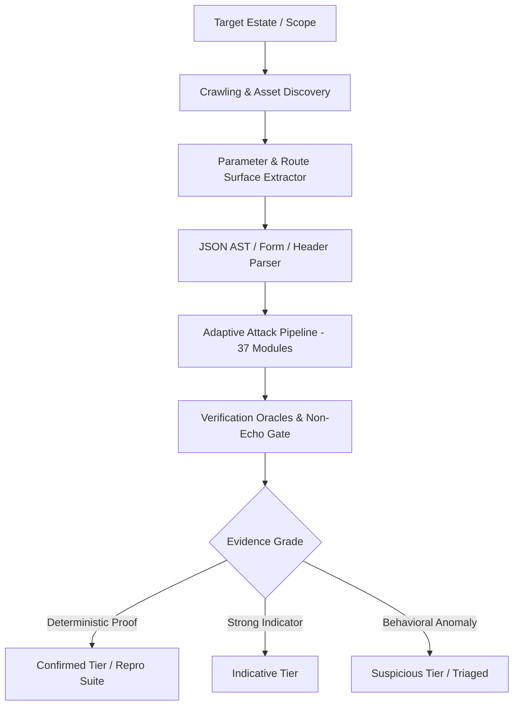
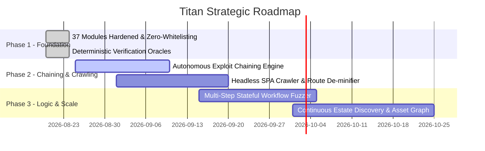

# Titan Security Engine: Comprehensive Architecture, Specification & Strategic Roadmap

---

## 1. Executive Overview

**Titan** is an autonomous, high-precision security testing and vulnerability auditing engine engineered to uncover deep technical vulnerabilities across web applications, REST/GraphQL APIs, multi-tenant cloud backends, and AI/LLM interfaces.

Titan was re-engineered from the ground up to solve the three fatal flaws of traditional automated security scanners:
1. **Shallow Vector Coverage (The 3-Payload Toy Limit)**: Standard scanners fire 2–3 generic payloads and give up. Titan implements comprehensive, multi-dialect active probe dictionaries across diverse database engines, language runtimes, cloud platforms, and operating systems.
2. **Naive Parameter Whitelisting**: Skipping parameters based on names (`if "url" not in param: skip`) blinds scanners to real vulnerabilities. Titan tests every discovered query parameter, form input, JSON AST node, and ambient HTTP header with **zero parameter whitelisting**.
3. **Hallucination & False-Positive Storms**: Simple HTTP status code shifts or raw input reflections frequently trigger false positives. Titan requires **deterministic mathematical, cryptographic, non-echo differential, or out-of-band (OOB) execution proof** via strict Verification Oracles before confirming a finding.

---

## 2. Core Architectural Pillars

### A. Zero-Whitelisting Injection Surface
* **Query & Form Parameters**: Every discovered key-value pair is tested across all HTTP verbs (`GET`, `POST`, `PUT`, `PATCH`, `DELETE`).
* **Nested JSON AST Walker**: Deeply nested JSON payload structures are recursively navigated and injected at leaf nodes without corrupting the surrounding syntax.
* **Ambient Header Fuzzing**: Ambient HTTP headers (`User-Agent`, `Referer`, `X-Forwarded-For`, `Client-IP`, `X-Real-IP`, `X-Api-Key`) are probed for command execution, template injection, and cache poisoning sinks.

### B. Multi-Dialect Payload Matrix
Payloads are dynamically selected and adapted based on target fingerprinting (WAF, OS, web server, runtime, database dialect) via `titan.ai.payloadforge.PayloadForge`.

### C. Multi-Tier Verification Oracles
* **Inert Echo Suppression**: Strips raw, URL-encoded, double-URL-encoded, HTML-entity-encoded, and JSON-escaped inputs to ensure input reflection is never confused with vulnerability execution.
* **Non-Echo Differential Oracle**: Validates that changes in response row sets or state transitions are driven by logical execution rather than input reflection noise.
* **Mathematical & Token Oracles**: Verifies SSTI via distinct mathematical computation evaluation (`{{7*7}} -> 49`), CSTI expressions, and unique command execution nonces (`TITAN_<nonce>`).
* **Statistical Timing Oracle (`BlindDetector`)**: Uses multi-sample statistical baseline standard deviation gating with declared-delay validation (`sleep(N)`, `ping -n N`) to eliminate false positives caused by network or CDN latency variance.
* **Out-of-Band (OOB) Oracle (`Interactsh`)**: Correlates DNS, HTTP, and LDAP callbacks for completely blind SSRF, RCE, XXE, and Deserialization vulnerabilities.

---

## 3. The 37 Detection Modules Matrix

| # | Module ID | Core Capabilities & Vectors | Verification Oracle Method |
|:---|:---|:---|:---|
| **01** | `sqli` | $O(\log N)$ Union Column Bisector, 30+ DB error signatures, Boolean differentials, polymorphic comment bypasses, JSON AST walker, Interactsh OOB. | Error signature presence + Non-echo row set differential. |
| **02** | `xss` | 6 Context Breakout Engines (HTML tag, attribute quote, JS string, CSTI math evaluation `{{7*7}}`, headers, JSON AST). | Unescaped character breakout confirmation. |
| **03** | `ssti` | 7-Engine Template Discrimination (Jinja2, Twig, Freemarker, Smarty, SpEL, Thymeleaf, Mako). | Dynamic math nonce evaluation + dialect string multiplication. |
| **04** | `rce` | Multi-OS Separators (POSIX `; & \| $()`, Windows `& \| %VAR%`), OS-specific delay tracking (`ping_n`, `ping_c`, `sleep`, `timeout`). | Nonce reflection + `BlindDetector` statistical timing gate. |
| **05** | `ssrf` | Multi-Cloud IMDS (AWS, GCP, Azure, DO, Alibaba), alternative IP encodings (decimal, hex, octal, IPv6, nip.io), same-origin internal routing. | Cloud metadata pattern validation + URL reflection strip. |
| **06** | `lfi` | POSIX/Windows traversal, PHP filter stream wrappers (`php://filter`), double-encoded traversals (`%2e%2e%2f`), null-byte bypasses. | Content-leak marker (`root:x:0`) + Filesystem errno differential. |
| **07** | `idor` | Sequential boundary stepping, UUID mutation, MongoDB 24-char ObjectID stepping, Base64 decoding/mutation, URL path ID fuzzing. | Structural JSON change + Non-echo value change. |
| **08** | `nosqli` | MongoDB Operator Matrix (`$ne`, `$gt`, `$where`, `$regex`, `$in`, `$exists`), PHP/Express query bracket notation, JSON body dict injection. | Boolean differential pairing (`$exists: true <-> false`). |
| **09** | `xxe` | POSIX/Windows file leaks, XML-SSRF, XInclude, SVG upload injection, parameter entities. | System file leak content + Parser error differential + OOB. |
| **10** | `jwt` | 200+ weak secret dictionary, `alg:none` case variations, `kid` path traversal / SQLi, RS256 $\to$ HS256 algorithm confusion. | Unsigned/tampered claim acceptance + Status escalation. |
| **11** | `cors` | Dynamic origin generation (subdomain confusion, suffix bypass, HTTP downgrade), null origin, OPTIONS preflight validation, `Vary: Origin` check. | Reflected origin + `Access-Control-Allow-Credentials: true`. |
| **12** | `deser` | Active probes across Java (`rO0AB`, Jackson `@type`), PHP (`O:8:...`), Python (`pickle`, `yaml`), .NET (`BinaryFormatter`), Node (`_$$ND_FUNC$$_`). | Leaked gadget class signatures + JNDI/LDAP OOB beaconing. |
| **13** | `auth` | SQLi/NoSQLi auth bypasses, HTTP verb tampering (HEAD, PUT, PATCH, PROPFIND), IP/role spoofing headers (`X-Forwarded-For`, `X-Admin`), path normalization (`/..;/`). | 401/403/405 $\to$ 200/302 escalation + Session creation. |
| **14** | `redirect` | Dual engine: HTTP Open Redirect (protocol-relative `//`, backslash `/\`, subdomain/suffix bypasses) + Playwright client-side hijack tracking. | `Location` header destination + Browser URL bar hijack proof. |
| **15** | `headers` | Security header audits (XFO, XCTO, HSTS, CSP with unsafe-inline/eval/wildcards, Referrer-Policy, COOP/CORP), server version leaks, Cookie security flags. | Response header analysis + Cookie directive validation. |
| **16** | `cache` | Unkeyed header poisoning (`X-Forwarded-Host`/`Scheme`/`Prefix`), Web Cache Deception path delimiter confusion (`/data;.css`), cache-buster nonces. | Reflection on unpoisoned secondary cache-buster requests. |
| **17** | `smuggling` | CL.TE & TE.CL parameter CRLF injection probes, Transfer-Encoding obfuscation headers (whitespace, duplicates, wrapped). | Multi-level keyword echo peeling + Timeout differential. |
| **18** | `crypto` | High-fidelity secret scanner (AWS AKIA/ASIA, Google, Stripe, OpenAI, Anthropic, Private Keys, Slack, Discord), weak hashing/ciphers, JWT `alg:none`. | Contextual pattern assignment matching + Entropy verification. |
| **19** | `race` | Microsecond-synchronized concurrency burst barrier (`asyncio.Event`) on state-changing methods (`POST`, `PUT`, `PATCH`, `DELETE`). | Counter-divergence oracle (filtering session token noise). |
| **20** | `logic` | Numeric tampering: negative values (`-1`, `-0.01`), free pricing (`0`), integer overflow (`2147483648`), micro-precision rounding (`0.00000001`). | Negative amount reflection in order state / Status redirection. |
| **21** | `upload` | 14-Probe Bypass Matrix (PHP/PHTML/JSP/ASPX, GIF/JPEG polyglots, double extensions, null bytes, `.htaccess` overrides, SVG XML/XSS, path traversal). | In-band execution nonce echo + Public file retrieval verification. |
| **22** | `massassignment` | 22-Field Privilege Matrix (`role`, `is_admin`, `is_superuser`, `tier`, `credits`, `org_id`), nested JSON AST traversal. | Structural JSON field:value pairing absent from baseline. |
| **23** | `sourcesecret` | Client-side JS bundle and `.js.map` sourcemap extraction, unminified `sourcesContent` inspection, high-entropy API token extraction. | Verbatim client-accessible secret extraction. |
| **24** | `sessionfix` | Multi-framework session cookie matrix (`PHPSESSID`, `JSESSIONID`, `ASP.NET_SessionId`, `connect.sid`, generic auth tokens). | Pre-auth probe cookie survival in post-auth `Set-Cookie`/body. |
| **25** | `bola` | 3-Way Differential (Owner Identity A, Attacker Identity B baseline, Attacker B cross-tenant request), URL path ID segment fuzzing. | Exclusive owner marker presence in attacker cross-response. |
| **26** | `fuzzer` | 18-Variant Bounded Mutation Dictionary (encodings, delimiters, boundaries, type confusion) across GET and POST parameters. | Strong-sink error class emergence vs Baseline differential. |
| **27** | `clientside` | Client-side prototype pollution (`__proto__`, `constructor.prototype`, deep-nested `a[__proto__][marker]`), DOM XSS sink tracking, postMessage audits. | `Object.prototype` property inheritance verification in browser context. |
| **28** | `api` | Swagger/OpenAPI spec discovery (12 standard paths), GraphQL schema introspection & query batching validation, shadow endpoint probing. | Parsed API schema structure + Valid GraphQL `__schema` types. |
| **29** | `apixss` | Static AST taint tracking: external data seeds (`fetch`, `axios`, `localStorage`, URL params) flowing into dangerous DOM sinks (`innerHTML`, `eval`). | Taint-flow graph connecting unvalidated input to DOM sink. |
| **30** | `cloud_control` | Cloud control plane probing, IMDSv1/v2 token negotiation, IAM role credential extraction, privilege escalation simulation (`sts:AssumeRole`). | Valid IAM credentials / STS role tokens extracted from body. |
| **31** | `deep_audit` | Target estate mapping, multi-service relationship aggregation, endpoint surface extraction, consent validation. | Estate inventory reconciliation. |
| **32** | `parserdiff` | Encoding disagreement testing (double-URL, HTML entity, unicode full-width, mixed case, null-byte) to bypass WAFs and reach origin parser sinks. | Encoded variant reaches strong parser sink while plain is blocked. |
| **33** | `supplychain` | CI/CD Poisoned Pipeline Execution (PPE), npm/PyPI dependency confusion, secret leaks in workflow YAMLs, unpinned GitHub Actions. | Unregistered public package names + Over-privileged CI/CD configs. |
| **34** | `llm` | Multi-trial consensus judge for direct/indirect prompt injection, system prompt leakage, out-of-band data exfiltration, and tool abuse. | Deterministic consensus agreement across $\ge N$ independent trials. |
| **35** | `llm_deep` | RAG document poisoning, tool-use hijacking, memorized training data extraction, and adversarial prompt attacks. | Document instruction override + Tool execution hijack confirmation. |
| **36** | `clientside/domxss` | Runtime Playwright browser-context DOM-sink hooking (`Element.innerHTML`, `document.write`, `eval`, `window.location`). | Attacker-controlled marker reaching hooked execution sink. |
| **37** | `trackg` | Ad-network redirect tracking, phishing hop classification, browser cloaking, in-browser cryptominers, push-notification abuse, SRI audits. | Observed malicious script signatures + Phishing redirect chains. |

---

## 4. Strategic Engineering Roadmap

### Phase 1: Core Engine Hardening (COMPLETED)
- [x] Exhaustive overhaul of all 37 detection modules.
- [x] Complete removal of naive parameter whitelisting across all engines.
- [x] Expansion to multi-dialect, multi-runtime payload matrices.
- [x] Verification oracle enforcement (inert echo suppression, statistical timing gates, OOB correlation).
- [x] 100% passing core regression test suite (245/245 tests).

### Phase 2: Autonomous Finding-Chaining Engine & SPA Discovery (NEXT)
- [ ] **Multi-Step Finding Chaining Engine (`titan/ai/chain_engine.py`)**:
  - Automatically feed low/medium findings (e.g. source map secrets, internal API route discoveries, unauthenticated endpoints) into secondary attack engines.
  - Construct complete attack chains: $\text{Source Secret} \to \text{Internal Route} \to \text{BOLA} \to \text{Privilege Escalation}$.
- [ ] **Headless SPA Route & GraphQL De-minifier**:
  - Integrate a Playwright crawler that executes JavaScript, triggers dynamic hydration events, captures background XHR/fetch traffic, and extracts routes from minified client chunks.

### Phase 3: Stateful Multi-Step Workflow Engine
- [ ] **State Machine Recorder & Fuzzer**:
  - Support multi-step business journeys (e.g., User Registration $\to$ Invite Workspace $\to$ Role Assignment $\to$ Checkout).
  - Inject logic mutations at state transition boundaries to uncover complex authorization and workflow bypasses.

### Phase 4: Distributed Estate & Cloud Asset Mapping
- [ ] **Continuous Asset Graph**:
  - Aggregate subdomain permutations, Certificate Transparency log monitoring, and cloud asset resolution to map full attack surfaces before launching active scanners.
