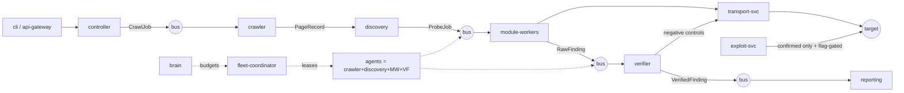

# Spec: Titan v2 — greenfield skeleton design

**Status:** design only. Nothing built. This document is the build contract for
the from-scratch v2 track; v1 (`Titan-Scanner`) remains the reference
implementation and the review/score asset.

**Standing constraints (non-negotiable, inherited from v1's lessons):**

1. **Contracts before code.** The message schema package is M0 and nothing
   else may merge before it. Every service talks only through contracts.
2. **Consent is a first-class contract field, not a service.** Every job
   envelope carries a `consent_ref`; every worker fails closed without a
   verified, unexpired, scanning-permitted consent. The v1 doctrine (signed
   ed25519 consents, `scanning: allowed|bounded|prohibited`, fail-closed on
   unreadable declarations) carries over verbatim.
3. **Active verification stays.** Verification re-probes targets through
   transport with negative controls. The v1 review's "kernel→transport is
   wrong" reading was wrong; v2 makes the active-verification contract
   explicit in the message schema instead of leaving it implicit in an arrow.
4. **Verdict discipline carries over.** Validation errors and server faults
   are UNVERDICTED non-answers — never positives, never negatives; coverage
   math separates verdicted from re-probe work.
5. **One-box mode is a product requirement, not a demo mode.** The full
   pipeline must run on a laptop (in-memory bus + SQLite/MinIO-profile) and
   scale to compose/K8s without contract changes. "Installs and runs its own
   tests in isolation" is the buyer criterion; it is also just engineering
   hygiene.
6. **No plaintext weapon-adjacent literals in source.** Encoded-literal
   policy from v1's AV lesson applies from the first commit; hash pins with
   every corpus.
7. **Gates from day one:** ruff, ruff format, mypy strict-on-packages,
   pytest with coverage floor, detect-secrets baseline, pip-audit — same
   step list as v1 CI so the enumerate-the-job lesson is already obeyed.

---

## 1. Repository shape

Monorepo, `uv` workspace, Python ≥3.12. One repo because contracts and
services must version in lockstep; split later only if a service team splits.

```
titan-v2/
├── pyproject.toml            # uv workspace root; shared lint/mypy config
├── packages/                 # versioned libraries (no I/O side effects at import)
│   ├── titan-contracts/
│   ├── titan-transport/
│   ├── titan-modules/
│   ├── titan-consent/
│   ├── titan-verdict/
│   └── titan-observability/
├── apps/                     # deployable services (thin: wire contracts to libs)
│   ├── api-gateway/
│   ├── controller/
│   ├── crawler/
│   ├── discovery/
│   ├── module-worker/
│   ├── verifier/
│   ├── transport-svc/
│   ├── fleet-coordinator/
│   ├── agent/
│   ├── brain/
│   ├── exploit-svc/
│   └── reporting/
├── cli/                      # titan CLI — thin client over gateway/bus
├── infra/                    # docker/, k8s/, dev/ (one-box profile)
├── lab/                      # deliberately vulnerable target (ported from v1)
├── tests/
│   ├── contracts/            # golden messages + schema-evolution tests
│   ├── integration/          # in-memory bus, full pipeline on lab
│   └── e2e/                  # compose profile: scan the lab, assert findings
└── docs/
```

**Rule:** `packages/` may not import from `apps/`. `apps/` are wiring only —
if logic accretes there, it belongs in a package.

---

## 2. Packages — what each one entails

### 2.1 `packages/titan-contracts` — the M0 package

**Purpose:** every message, domain object, and enum in the system, as pydantic
v2 models. This package alone defines the distributed system.

**Contents:**

- **Envelope** (the only thing that crosses a bus):
  `Envelope(kind, schema_version, id, trace_id, causation_id, ts, producer,
  consent_ref | None, payload)`. Additive-only evolution; `schema_version`
  gates decode; unknown-kind = dead-letter, never crash.
- **Domain models:** `Target`, `Scope`, `PageRecord`, `Endpoint`, `Probe`,
  `ParamHint`, `Evidence`(request/response pair, redacted), `Finding`,
  `Budget`, `Lease`.
- **Job/queue contracts:** `CrawlJob`, `DiscoveryJob`, `ProbeJob{probe,
  modules[], budget, consent_ref}`, `VerificationTask{raw_finding,
  control_plan}`, `ReportJob`.
- **Verdict enum + finding states:** `confirmed | suspicious | none |
  unverdicted`, with `unverdicted_reason ∈ {validation_error, server_fault,
  dead_request, scope_exit}` — the v1 ledger, now in the wire format.
- **Consent contracts:** `ConsentRef{id, target, basis, scanning, flags,
  expires_at, key_id, signature}` and `ConsentVerification` — the signed
  document itself never rides the bus; refs do.
- **Control-plane contracts:** `AgentRegistration`, `Heartbeat`,
  `JobClaim`, `JobResult`, `LeaseGrant`, `LeaseRenewal`, `Backpressure`,
  `BudgetUpdate`.
- **Redaction policy enforced in-model:** operator secrets and credential
  material are rejected by validators (field allowlists, not blocklists).
- Golden-fixture loader: every contract ships a `.json` golden message;
  tests assert decode-encode round-trip stability.

**Depends on:** pydantic only. **Talks to:** everyone — as data, never as a
call.

### 2.2 `packages/titan-transport`

**Purpose:** the protocol abstraction and implementations, as a pure library
**and** the engine of the transport-svc app. Request/response is a contract
type, so verification can send its own probes without touching modules.

**Contents:**

- `TransportClient` protocol: `send(AttackRequest) -> AttackResponse` with
  per-call `budget` (rate, jitter, proxy policy) and `consent_ref` — the
  client itself refuses to send without a verified scanning-permitted consent
  ref (fail-closed at the egress chokepoint: the one place every packet
  crosses).
- Implementations: `http` (aiohttp, pooled), `tor`, `websocket`, `grpc`,
  `ssh`, `mqtt` (latter three ported from v1 lazily, in M4+).
- Egress policy engine: scope-match (v1 domain-scope logic), private-address
  refusal (v1's SSRF-against-operator guard), rate budgets, proxy rotation.
- Local-dry mode: `RecordingTransport` — deterministic canned responses for
  tests and the one-box offline profile.

**Depends on:** contracts, observability. **Talks to:** module-worker,
verifier, exploit-svc (as library), transport-svc (as service).

### 2.3 `packages/titan-modules`

**Purpose:** the detector library. Each module is a pure-ish async callable:
`(ProbeJob, TransportClient, Fingerprint) -> list[RawFinding]`. No bus, no
DB, no global state — that is what makes workers horizontally scalable and
modules unit-testable.

**Contents:**

- **Module SDK:** `@module` registration via package entry-points, `manifest`
  (name, area, required context, budget class, concurrency class), input
  expectations.
- **Module contract tests (mandatory for every module):** given golden
  `ProbeJob` + `RecordingTransport` cassette, produce exactly the pinned
  `RawFinding` set; refuse unconsented jobs; respect budget; emit
  `unverdicted` on fault shapes. A module without contract tests does not
  register.
- **Payload corpora:** ported from v1 (payloadforge/payloadsmith tables),
  encoded-literal policy per AV lesson; `titan-corpus` CLI to re-pin hashes.
- The ~40 v1 areas ported **module-by-module behind the SDK**, prioritized in
  the build order (§6). v1 stays runnable until a module's port + contract
  tests land; the porting diff is pure.

**Depends on:** contracts, transport (as protocol), observability.

### 2.4 `packages/titan-consent`

**Purpose:** v1's consent doctrine as a standalone library — verify signed
consents, evaluate `scanning` policy, fail closed. The single most
differentiating component; it must be importable by every service.

**Contents:** key loading/rotation, `verify()`, `require_automation()`,
policy evaluation, CLI (`consent add/list/revoke`), keyring profile for the
one-box mode. Ported from `titan/exploit/consent.py` + `authorization.py`
essentially unchanged — v1 got this right; keep it.

### 2.5 `packages/titan-verdict`

**Purpose:** evidence grading + the verdict ledger as a library, so worker
and verifier share one grading implementation.

**Contents:** oracle framework (echo/differential/timing/crypto/identity
oracles ported from v1 `titan/verify/`), negative-control planner (which
benign probes to send — this is the *client* of transport, making active
verification an explicit contract), `VerdictLedger` (append-only, replayable),
coverage math (verdicted vs re-probe denominators), repro-script generator.

### 2.6 `packages/titan-observability`

**Purpose:** logging/tracing/metrics wired once, used everywhere.

**Contents:** structured JSON logging (python-json-logger, v1 pattern),
OpenTelemetry trace propagation from `Envelope.trace_id` (trace context
lives in the envelope, not in a vendor SDK), Prometheus metrics helpers,
opt-in Sentry hook behind `TITAN_SENTRY_DSN` (v1 pattern: optional extra,
function-local import, never enabled by default).

---

## 3. Apps — what each one entails

**Shared shape:** every app is a thin process: parse env/config (pydantic
settings, v1 config-validation discipline), subscribe/publish contracts,
delegate to packages. Apps contain no business logic; if they do, move it
down.

### 3.1 `apps/api-gateway`
REST + gRPC ingress. AuthN for operators, scan submission, status queries,
finding queries, webhook ingestion (external-tool integration). Emits
`ScanAccepted`; exposes read models fed by reporting/persistence. The only
public surface; everything else is bus-internal.

### 3.2 `apps/controller`
The scan lifecycle orchestrator. Validates config (v1 `config_schema`
discipline), verifies consent via the consent package, registers the scan,
sets budgets, enqueues the first `CrawlJob`, watches progress, enforces
deadlines/cancellation, closes scans. Owns the **state machine**:
`accepted → consent_verified → crawling → probing → verifying → reporting →
closed` (+ `failed/cancelled`), persisted as events (event-sourcing lite).

### 3.3 `apps/crawler`
Stateless BFS crawl service. Consumes `CrawlJob`, respects scope + profile
(fast/deep/hostile budgets from v1), emits `PageRecord`s and `DiscoveryJob`s.
Browser-backed pages (Playwright) are a capability flag on the job; headless
pool managed here. Dedup by URL fingerprint + content hash.

### 3.4 `apps/discovery`
Turns `PageRecord`s into `Probe`s: parameter extraction, form parsing,
endpoint/OpenAPI/GraphQL schema inference, technology/BaaS fingerprinting
(v1 fingerprint logic ported). Emits `ProbeJob`s tagged with module
assignments — discovery *nominates*, budget policy decides.

### 3.5 `apps/module-worker`
Consumes `ProbeJob`s; instantiates the SDK modules assigned in the job;
sends attacks through the transport client; emits `RawFinding`s and
`unverdicted` observations. Concurrency class from the module manifest
(slow/edge-triggered modules like race get dedicated lanes). Stateless +
horizontally scalable; work-stealing via competing consumers.

### 3.6 `apps/verifier`
Consumes raw findings; builds the negative-control plan (titan-verdict),
sends controls *through transport* (active verification — the contract that
v1's review misunderstood), runs oracles, grades evidence, emits
`VerifiedFinding`s with full oracle trails. Only `confirmed` proceeds to
reporting; `suspicious` goes to the re-probe lane; everything is ledgered.

### 3.7 `apps/transport-svc`
Shared egress service wrapping the transport package: connection pools,
proxy rotation, rate limiting, egress policy enforcement, per-target
politeness. Every packet to a target crosses exactly this service — the
consent-check chokepoint with network-level teeth.

### 3.8 `apps/fleet-coordinator`
Target-lease scheduler across agents (Thompson-sampling assignment ported
from v1), agent registry/health, global budget arbitration, and the
**merger**: cross-agent finding dedup (finding fingerprints) and
corroboration (independent agents confirming the same finding upgrade
confidence).

### 3.9 `apps/agent`
The v2 primary runtime (per the v2 diagram's "Fleet as Core Scanners"): one
deployable that runs crawler + discovery + module-worker + verifier subsets
locally, claiming `LeaseGrant`s from the coordinator. In one-box mode, this
is the whole system in one process with the in-memory bus.

### 3.10 `apps/brain`
Strategy engine: engagement telemetry → what to scan next; budget
reallocation; strategy evolution (v2-late, per v1's over-scoping lesson —
ships last, behind flags, never on the critical path).

### 3.11 `apps/exploit-svc`
Track E, consent-gated exploitation: planner, C2 listener, SQLi dump, SSRF
pivot — ported from v1's exploit layer with `need=` gating per action
(shells/write/persistence/pivot), now *enforced at the service boundary*:
the exploit service refuses any job whose consent lacks the required flag,
and every action emits an audit event. Not reachable until verifier emits
`confirmed`.

### 3.12 `apps/reporting`
Consumes confirmed findings; builds HTML dashboard, markdown, estate rollups,
remediation reports (ported from v1 reporting); writes to object storage;
updates read models. Consent rows render the declared policy (`(unset)`
honesty rule carried over).

---

## 4. Persistence & infra profile

| Concern | One-box (dev/laptop) | Compose | K8s/production |
|---|---|---|---|
| Bus | in-memory (`packages` bus with the same Envelope API) | RabbitMQ | RabbitMQ cluster / SQS |
| State/locks | SQLite + file locks | Redis | Redis Cluster |
| Findings store | SQLite | PostgreSQL | PostgreSQL |
| Objects (reports/evidence) | local dir | MinIO | S3 |
| Deploy | `python -m titan.agent` | `docker compose up` | Helm |

**Contract invariant:** the Envelope API is identical across profiles; only
the bus adapter changes. Tests run the full pipeline against the in-memory
bus by default; compose-based e2e is the nightly job.

---

## 5. Overall — end-to-end data flow



Sequence: submit → consent verified (fail-closed) → crawl → discover →
probe (budgeted, consented) → raw findings → actively verified (controls
re-probe the target) → confirmed findings → reports; exploit only behind
confirmed verdict + matching consent flags; fleet agents run the middle of
the pipeline as lease-holders; every hop is an Envelope on one bus.

---

## 6. Build order (each milestone shippable and demonstrable)

| M | Delivers | Done means |
|---|---|---|
| **M0** | `titan-contracts` + goldens + schema-evolution tests; in-memory bus; repo scaffolding, CI gates | contract tests green; a hand-written Envelope round-trips all profiles |
| **M1** | controller + crawler + discovery + module-worker + verifier + reporting **on the in-memory bus**, transport in local-dry mode; port 3 modules (sqli, xss, headers) behind the SDK | `python -m titan.agent scan lab/` finds the lab's seeded findings e2e in-process |
| **M2** | real broker profile (RabbitMQ), `transport-svc` split with live HTTP + egress policy, consent package wired at chokepoints | same e2e under compose; killing a worker mid-scan loses nothing (at-least-once + dedup) |
| **M3** | fleet-coordinator + agent leases + merger; 10+ modules ported with contract tests | two agents scan two targets; merger dedups/corroborates; coordinator rebalances on agent death |
| **M4** | verifier full oracle set; brain v0 (budget hints only); exploit-svc ported behind the service-level flag gate | repro scripts + verdict ledger e2e; exploit refuses unconsented jobs (tests prove it) |
| **M5** | K8s profile, autoscaling, full OTel tracing, remaining module ports | nightly e2e on compose green; load profile documented |

Porting rule: a v1 module migrates only with its contract tests + corpus
pins; v1 stays the fallback until M4's parity list is checked off.

---

## 7. Testing strategy

- **Contract tests** (`tests/contracts`): golden messages per Envelope kind;
  additive-evolution assertions (old goldens decode under new schemas).
- **Module contract tests** (in `titan-modules`): mandatory per module —
  cassetted transport, pinned findings, budget obedience, consent refusal.
- **Integration** (`tests/integration`): full pipeline on the in-memory bus
  against the lab; chaos cases (worker death, duplicate delivery, poison
  message → dead-letter, budget exhaustion mid-scan).
- **E2E** (`tests/e2e`): compose profile scans the lab; asserts seeded
  findings confirmed, zero false positives on the lab's clean routes,
  consent-prohibited scans never send a packet (asserted at transport-svc).
- **Static gates:** ruff/format, mypy (strict on `packages/`), detect-secrets
  baseline, pip-audit — enumerated, never assumed.

## 8. Acceptance for this spec's skeleton itself

- [ ] Every folder above has a one-paragraph charter (this doc).
- [ ] Every cross-service arrow is an Envelope kind named in §2.1.
- [ ] Consent enforcement points are enumerated: gateway, controller,
      transport-svc, module-worker, verifier, exploit-svc.
- [ ] One-box and cluster profiles differ only by adapter wiring.
- [ ] M0–M5 are each independently demonstrable.
